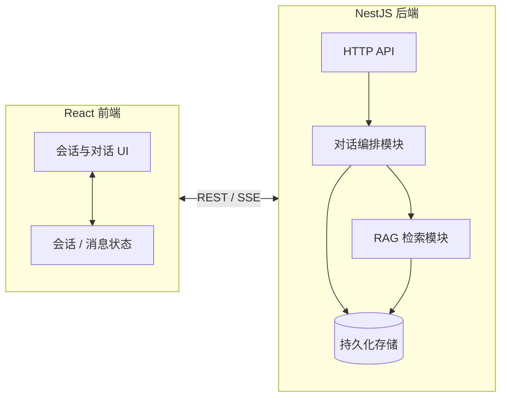

# 对话历史与 RAG 检索 — 技术方案

## 1. 文档说明

| 项目 | 说明 |
|------|------|
| 依据 | 《需求分析.md》中关于会话管理、消息历史、RAG 检索及前端交互场景的功能需求 |
| 目标 | 约定前后端技术选型、职责划分、数据与请求链路及扩展方向，**不包含具体代码实现** |
| 技术栈 | 前端：**React**；后端：**NestJS**（沿用现有工程） |

---

## 2. 总体架构

### 2.1 逻辑结构

采用 **浏览器端单页应用（React）+ NestJS HTTP/SSE 服务** 的经典前后端分离形态：

- **React 前端**：负责会话列表与当前会话状态、消息时间线展示、流式渲染、加载与错误态；通过 **REST 风格接口** 管理会话与历史，通过 **SSE（或等价流式协议）** 消费助手流式输出。
- **NestJS 后端**：负责鉴权（若启用）、会话与消息的持久化、对话编排（含工具调用）、RAG 向量检索与注入、对嵌入模型的调用；**不向浏览器暴露密钥**。

### 2.2 架构示意（逻辑）

---

## 3. 前端技术方案（React）

### 3.1 工程形态

- 推荐使用 **Vite + React**（或团队统一的 React 脚手架）构建 SPA，与 Nest 开发端口分离，通过 **环境变量** 配置后端基地址（如 `VITE_API_BASE_URL`）。
- 生产环境由静态资源托管（Nginx、CDN 或 Nest 静态目录）与 **同源或反向代理** 统一入口，避免跨域配置散落多处（具体部署见第 7 节）。

### 3.2 路由与页面

- **主对话页**：承载会话列表（侧栏或抽屉）+ 当前会话消息区 + 输入区；路由可设计为 `/chat` 或 `/chat/:sessionId`，进入时根据 `sessionId` 拉取消息历史。
- **可选**：独立「欢迎/空状态」与「带会话」共用同一布局，通过状态区分「无会话 / 有会话未选 / 已选会话」。

### 3.3 状态管理

- **会话维度**：当前选中的 `sessionId`、会话列表（含预览标题、最近活跃时间等展示字段）、列表加载与刷新状态。
- **消息维度**：当前会话下的消息数组（角色、内容、时间序）、分页或一次性加载策略由实现阶段确定；发送中、流式输出中、失败重试等 **UI 状态** 与消息实体分离，避免半成品消息长期污染权威列表。
- 选型建议：**React Query（TanStack Query）** 管理服务端缓存与会话/消息的失效刷新；局部 UI 状态可用 **useReducer** 或轻量 **Zustand**，避免过度中心化。

### 3.4 与后端交互方式

| 能力 | 建议技术要点 |
|------|----------------|
| 会话创建 / 列表 / 消息历史 | `fetch` 或 axios，配合 React Query 的 `queryKey` 按 `sessionId` 隔离 |
| 非流式对话 | 单次请求，响应体包含 `answer` 与 `sessionId`（若创建了新会话） |
| 流式对话 | **EventSource** 或 `fetch` + **ReadableStream** 解析 SSE；从响应头读取 **会话标识**（若本轮新建会话），与消息列表刷新时机对齐 |
| 错误与重试 | 网络错误、4xx/5xx 与业务错误码分层；列表与发送按钮的 **防抖 / 禁用** 避免重复提交 |

### 3.5 流式输出与「历史一致」

- 流式阶段：在界面中展示 **当前轮助手的增量文本**（独立缓冲区），不直接作为持久化消息的最终态，避免中途刷新导致半条消息入库展示不一致。
- 本轮结束：以服务端落库结果为准，**重新拉取该会话消息列表** 或 由接口约定返回本轮完整助手消息，再合并到时间线，与《需求分析》中「结束后与列表一致」对齐。
- 失败：清空或标记本轮流式缓冲区，提示用户；是否保留用户已发送内容由产品与接口约定（前端展示「仅本地已发、助手未成功」状态）。

### 3.6 体验相关（实现层约束）

- 长消息：**折叠 / 展开** 为纯前端组件行为，不依赖后端。
- 当前会话高亮：由 `sessionId` 与路由或全局状态比对即可。
- 可选「已参考本对话相关内容」等提示：由 **后端返回布尔或枚举** 驱动，避免前端伪造。

---

## 4. 后端技术方案（NestJS）

### 4.1 模块划分（逻辑）

在现有 Nest 应用上扩展或收敛为清晰边界：

- **会话与消息模块**：会话 CRUD、消息按会话查询；与 TypeORM（或现有 ORM）实体一一对应。
- **对话编排模块**：承接用户输入，组装系统提示、工具定义、多轮工具调用循环；**流式与非流式** 共用同一套业务规则时，抽取共享服务，避免两套逻辑漂移。
- **RAG 模块**：嵌入向量生成、向量片段持久化、按会话（及可选全局）检索 Top-K、将检索结果注入系统提示或独立上下文块。
- **工具模块**：邮件、搜索、数据库、定时任务等保持现有能力，由对话编排统一调度。

### 4.2 会话与消息持久化

- **会话表**：唯一标识、可选标题、创建/更新时间；列表排序默认按 **最近活跃时间**（可在消息写入或会话更新时维护）。
- **消息表**：会话外键、角色（用户/助手）、内容、创建时间；支持后续分页查询。
- **删除策略**：若产品提供删除会话，采用 **级联删除** 或软删除，与 RAG 片段表一并约定，避免孤儿向量。

### 4.3 RAG 链路（服务端）

1. **写入时机**：每轮对话完成后，将本轮用户问题与助手回复按策略 **切分为片段**，调用嵌入模型生成向量，与 `sessionId` 关联持久化。
2. **检索时机**：新一轮用户问题到达后、调用大模型前，用 **同一嵌入模型** 对当前问题生成向量，在 **限定范围**（默认当前会话）内做相似度检索，取 Top-K。
3. **注入方式**：将检索结果格式化为只读上下文，拼入系统提示或作为独立 `system`/`human` 块（由编排策略统一，避免与工具说明冲突）。
4. **跨会话检索**（可选）：若产品启用「全局知识」，需增加按用户或租户的作用域字段，检索时增加过滤条件，并在响应中可附带 **是否跨会话** 供前端展示文案。

### 4.4 接口形态（约定层面）

不写具体字段名与代码，仅约定 **资源与动词**：

- `POST` 创建会话；`GET` 会话列表；`GET` 某会话消息列表（支持后续分页参数）。
- `GET` 非流式对话：查询参数或请求体携带 `query` 与可选 `sessionId`；响应包含回答文本与会话标识。
- `GET`（或 `POST`）流式对话：建立 SSE 流；响应头或首包携带新建会话标识；流结束后客户端再拉取消息或由约定事件通知完成。

**说明**：若将来需统一为 `POST` 以规避 URL 长度限制或统一鉴权体，可在实现阶段替换，本方案仅约束「资源含义」不变。

### 4.5 与现有控制器的关系

- 将「AI 对话、会话、RAG」相关路由集中在 **统一前缀**（如 `/ai`），便于网关与权限策略挂载。
- **全局管道**：校验、日志、限流（若有）挂在模块或控制器层。
- **SSE**：注意 Nest 与 Node 流式响应的生命周期、客户端断开时的资源释放，避免悬挂的订阅。

---

## 5. 数据与一致性

### 5.1 权威数据源

- **用户可见的消息列表** 以数据库中消息表为准；RAG 向量表为辅助，不得反向覆盖消息展示。
- 流式失败时，以产品规则决定是否写入「用户消息无助手回复」等状态，避免前后端理解不一致。

### 5.2 RAG 与隐私

- 默认 **仅当前会话** 检索时，向量记录必须带 `sessionId`，检索条件禁止泄漏其他会话。
- 若启用全局检索，必须在技术方案评审中明确 **租户隔离** 与 **审计** 需求。

---

## 6. 安全与配置

- **密钥**：大模型与嵌入模型 API Key **仅服务端** 环境变量；前端构建产物不包含密钥。
- **CORS**：开发环境允许前端源；生产环境通过同源代理或白名单域名收紧。
- **鉴权**（若后续需要）：JWT 或 Session 挂载在 Nest Guard 上，会话与消息查询 **必须** 与当前用户标识绑定，防止越权读取他人会话。

---

## 7. 部署与联调

- **开发**：React 开发服务器与 Nest 不同端口，配置代理或 CORS；环境变量指向本地 Nest 地址。
- **生产**：推荐 **反向代理** 将 `/api`（或统一前缀）转发到 Nest，静态资源由 React build 输出；SSE 需确认代理 **缓冲关闭** 与超时时间，避免流式被截断。

---

## 8. 测试与验收（技术侧）

- **接口契约**：对会话创建、消息列表、对话（含 `sessionId` 传递）做集成测试或契约测试。
- **RAG**：用固定会话构造多轮对话后，新问题应能检索到相关片段（可通过日志或调试开关验证，不强制对用户展示片段）。
- **前端**：会话切换后请求必须携带正确 `sessionId`；流式结束与列表刷新顺序符合第 3.5 节描述。

---

## 9. 后续扩展（非本期必做）

- 消息分页、会话标题自动生成、删除单条消息与向量同步失效。
- 向量库从关系型存储迁移至专用向量数据库时的 **迁移策略** 与双写期方案。
- 多模态消息（图片、文件）对 RAG 切分策略的影响。

---

## 10. 文档版本

| 版本 | 日期 | 说明 |
|------|------|------|
| v1.0 | 2026-03-29 | 初稿：React + NestJS 技术方案，对齐《需求分析》 |
